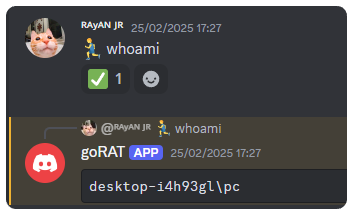

GoRAT (Go Remote Access Tool) is an extremely powerful yet simple remote administration tool controlled via a Discord bot. The project is still in development, with ongoing work to implement new commands for automating post-exploitation and information gathering.
**Disclaimer:** This tool is intended for educational purposes, CTF players, Go enthusiasts, and security experts.

### Supported Distros:

| 64Bit Distros       | 32Bit Distros                 |
|---------------------|-------------------------------|
| Windows 10,11       | Windows 10,10                 |

### Configuration

To configure the project, the user needs to use the setup.exe file to input the bot token and channelID. This file will allow the necessary parameters for the bot to be set up correctly.

Using the setup.exe file:
1. Run the setup.exe file.
2. Enter the bot token and channelID in the respective fields.
3. Once completed, the setup.exe file will save the configuration and compile the goRAT with the user's Discord bot configuration.


#### Compiling the setup.exe file manually:
If you prefer to compile the `setup.exe` file yourself, you can do so by running the following command in Go:
```sh
go build -o setup.exe -ldflags "-H=windowsgui" .\config_form\config_form.go
```
This command will compile the project and create the `setup.exe` file, which will allow you to input the `bot token` and `channelID` and then compile the goRAT with the user's Discord bot configuration.

### Using Discord Commands 

Once the RAT is executed on a target machine, a private channel is automatically created for each instance. This channel is dedicated to reporting information and activities related to that particular instance of the RAT.

#### Information Reported in the Private Channel:

Every time the RAT is executed, the bot will create a private channel in Discord and report the following details about the target machine:

- IP Address: The private IP address of the target machine.
- User: The username of the logged-in user on the target machine.
- Hostname: The hostname of the target machine.
- OS: The operating system running on the target machine.
- CWD (Current Working Directory): The current working directory of the target machine.

#### Available Commands:

- `🏃‍♂️ {Command Here}`: Execute any command on the target machine. Replace {Command Here} with the desired command you want to run on the target machine .


- `💀`: This command will stop the RAT and effectively halting the remote session.

### TODO

- [ ] Task 1: Run the setup.exe file

