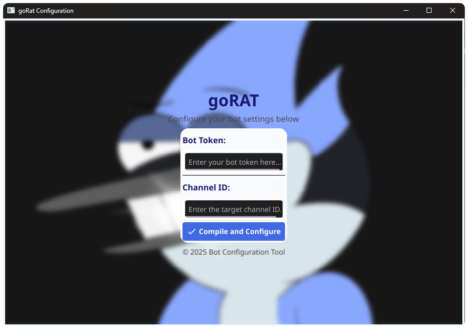

GoRAT (Go Remote Access Tool) is an extremely powerful yet simple remote administration tool controlled via a Discord bot. The project is still in development, with ongoing work to implement new commands for automating post-exploitation and information gathering.
**Disclaimer:** This tool is intended for educational purposes, CTF players, Go enthusiasts, and security experts.

### Supported Distros:

| 64Bit Distros       | 32Bit Distros                 |
|---------------------|-------------------------------|
| Windows 10,11       | Windows 10,10                 |

### Configuration

To configure the project, the user needs to use the setup.exe file to input the bot token and channelID. This file will allow the necessary parameters for the bot to be set up correctly.

Using the setup.exe file:
1. Run the setup.exe file.
2. Enter the bot token and channelID in the respective fields.
3. Once completed, the setup.exe file will save the configuration and compile the goRAT with the user's Discord bot configuration.



#### Compiling the setup.exe file manually:
If you prefer to compile the `setup.exe` file yourself, you can do so by running the following command in Go:
```sh
go build -o setup.exe -ldflags "-H=windowsgui" .\config_form\config_form.go
```
This command will compile the project and create the `setup.exe` file, which will allow you to input the `bot token` and `channelID` and then compile the goRAT with the user's Discord bot configuration.

### Discord Control 

